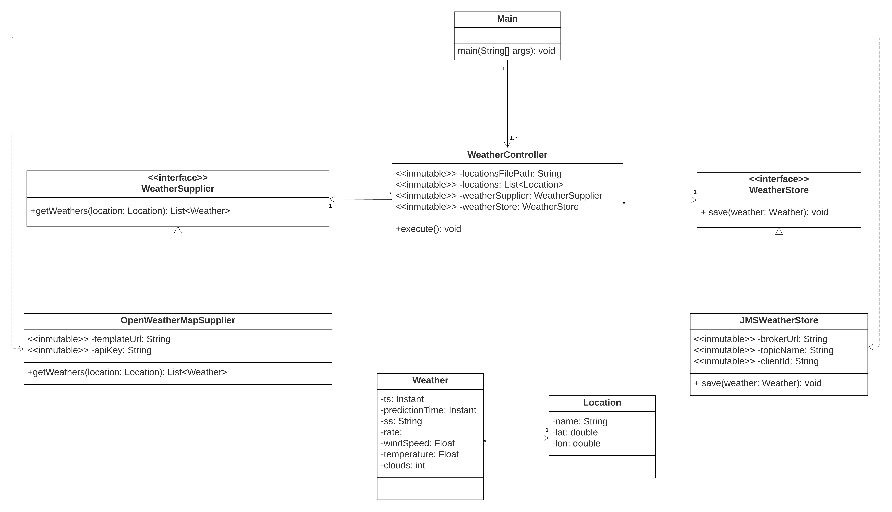
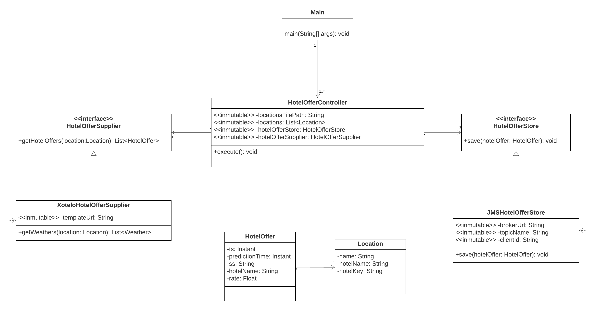
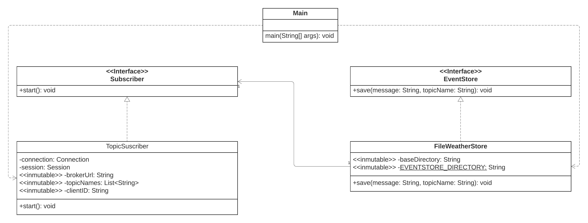
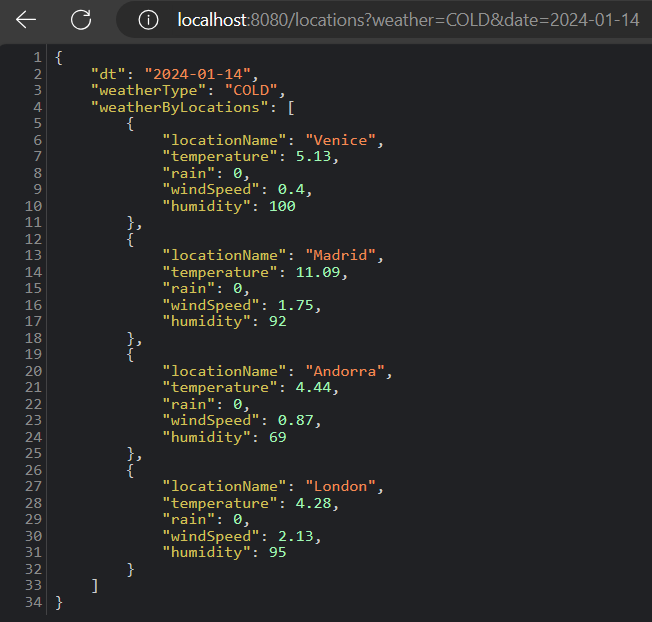
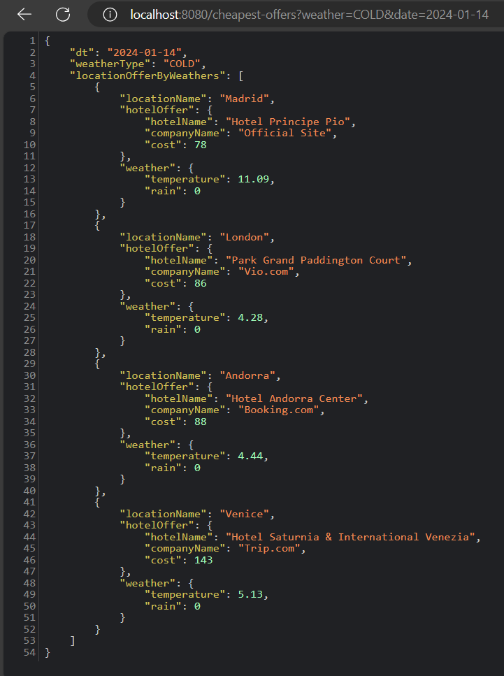
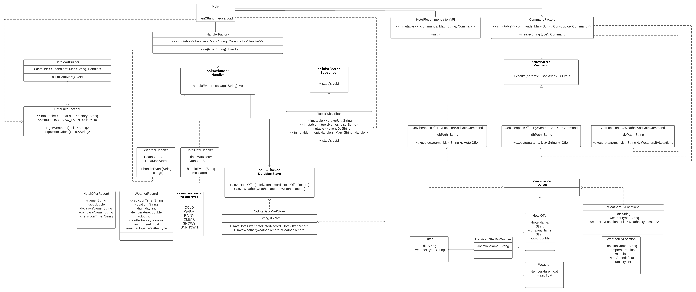

# Cover Page:

- **Subject:** Data Science Application Development (DACD)
- **Academic Year:** 2023-2024
- **Degree:** Data Science and Engineering (GCID)
- **School:** School of Computer Engineering (EII)
- **University:** University of Las Palmas de Gran Canaria (ULPGC)

# Main Functionality

This project comprises 4 modules. Users can interact with the application through a REST API that defines three routes, explained later. Specifically, the REST API aims to exploit data on hotel offers and weather forecasts.

The application allows users to select holiday destinations based on 5 types of weather (COLD, WARM, RAINY, SNOWY, and CLEAR). Each weather type has assigned locations based on meteorological variables obtained from OpenWeatherMap for the next 5 days at noon. Additionally, hotel offers obtained from Xotelo are integrated, allowing users to find the cheapest offer for a given weather type or location. In the case of Xotelo, data is collected from tomorrow onwards (as the platform does not allow the check-in and check-out dates to be the same) up to 5 days in advance. This approach accommodates potential failures in Xotelo, providing more chances to obtain the required data.

Meteorological data is updated every 6 hours, and hotel offers are collected daily.

# Resources Used
- **Development Environment:** IntelliJ IDEA.
- **Version Control Tools:** Git, GitHub

# How to Run the Program

The program can be easily executed by following these steps:

1.  Download the latest version of the project from the Releases of the project.
2.  Unzip the folders and place them in the desired location.
3.  Start the ActiveMQ broker from [ActiveMQ (apache.org)](https://activemq.apache.org/).
4.  Run the 'event-store-builder' module; you'll need to specify the directory where you want to store the data lake.
    *   **Requirements:** Pass the base path and topic names as arguments.
    *   Use the command `java -jar event-store-builder-1.0-SNAPSHOT-jar-with-dependencies.jar your_directory`.
5.  Repeat the above step for the 'weather-responsive-hotel-offer-advisor,' 'weather-provider,' and 'hotelOffer-provider' modules. Here's an example; remember to replace the program argument values with your desired ones.
    *   **Requirements:**
        *   'weather-provider': Requires the API key as an argument and the path to the file with information about locations (see note below for more information).
          *  You can obtain your API key from this link → [Members (openweathermap.org)](https://openweathermap.org/members)
        *   'hotelOffer-provider': The path to the file with information about locations.
        *   'weather-responsive-hotel-offer-advisor': You will need the base datalake directory and the base datamart directory.
    *  **Examples:**
      * 'weather-provider': `java -jar weather-provider-1.0-SNAPSHOT-jar-with-dependencies.jar your_apiKey path_of_locations_file`.
      * 'hotel-provider': `java -jar hotel-provider-1.0-SNAPSHOT-jar-with-dependencies.jar path_of_locations_file`.
      * 'weather-responsive-hotel-offer-advisor': `java -jar weather-responsive-hotel-offer-advisor-1.0-SNAPSHOT-jar-with-dependencies.jar base_dataLake_directory base_datamart_directory`.

Note: The locations file will be a .tsv file with columns:

*   Location name (e.g., a city or town)
*   Latitude
*   Longitude
*   Hotel name
*   Hotel key: the key associated with each hotel on TripAdvisor (get yours [here](https://xotelo.com/how-to-get-hotel-key.html))

Implementation:
---------------

The application was developed in the IntelliJ environment and uses Maven. It follows a publisher-subscriber architecture with the following modules:

### weather-provider:

*   **Function:** Retrieves weather forecasts every 6 hours from OpenWeatherMap.
*   **Design:** Uses the MVC pattern:
    *   Model:
        *   Weather: includes meteorological information such as temperature, humidity, rain probability, etc., along with the time it was saved (ts), forecast time (predictionTime), and an identifier of the topic that sent it (ss).
        *   Location
    *   Control:
        *   OpenWeatherMapSupplier: Implements the WeatherSupplier interface, retrieves data from OpenWeatherMap.
        *   JMSWeatherStore: Implements the WeatherStore interface, responsible for sending data in JSON format to the ActiveMQ broker.
        *   WeatherController: Manages the data to be obtained every 6 hours and ensures it is sent as it arrives. Also loads locations so that OpenWeatherMapSupplier knows which locations to fetch data for.
    *   Main: Similar to other packages, initializes controllers, i.e., the classes mentioned above.

### hotel-provider:

*   **Function:** Retrieves hotel offers from Xotelo every day.
*   **Design:** Similar to 'weather-provider':
    *   Model:
        *   HotelOffer: Equivalent to the Weather class but for hotel offer information. It's important to note that the price is obtained by adding the tax to the base price.
        *   Location: In this case, it includes an attribute hotelKey corresponding to the hotel's key on TripAdvisor, which you can get on this [website](https://xotelo.com/how-to-get-hotel-key.html).
    *   Control:
        *   XoteloHotelSupplier: Implements the HotelOfferSupplier interface, retrieves data from Xotelo for different hotels.
        *   JMSHotelStore: Implements the HotelOfferStore interface, equivalent to the JMSWeatherStore class.
        *   HotelController: Analogous to the WeatherController class, but the timer is set every 24 hours.

### datalake-builder:

*   **Function:** Builds a DataLake with data received from the 'weather-provider' and 'hotel-provider' brokers.
*   **Design:** Uses classes such as:
    *   FileEventStoreBuilder: Implements the EventStoreBuilder interface with the save() method and is responsible for saving data from topics in the following directory structure: `datalake/eventstore/{topic}/{ss}/{YYYYMMDD}.events` where the topic is the origin topic of the message, YYYYMMDD is the year-month-day obtained from the event's ts, and ".events" is the file extension in which events associated with a specific day are stored, for example, 20231103.events. Events will be added to the end of the file, with one event per line.
    *   TopicSubscriber: Implements the Subscriber interface and is responsible for creating a durable subscriber to collect data. Calls the save() method of FileEventStore to save the data one by one as it arrives.

### weather-responsive-hotel-offer-advisor:

*   **Function:** Implements business rules and creates a data mart based on an SQLite database.
*   **Design:** Follows the MVC pattern:
    *   Model:
        *   HotelOfferRecord: Represents one of the columns of the Hotels table in the database.
        *   WeatherRecord: Equivalent to HotelOfferRecord but for weather-related information.
        *   WeatherType: An enumeration that classifies weather into different types (COLD, WARM, RAINY, SNOWY, and CLEAR).
    *   Control:

        *   Exceptions: Some custom exceptions are defined to prevent improperly handled exceptions.
        *   Commands: Creates a Command factory representing requests to the database to fulfill API queries. So, for each class implementing the Command interface, it will be a data query.
        *   Handlers: Also creates a Handlers factory, in this case, two, one for Weather and another for HotelOffer, where data is processed to build the model and save it in the database. Each Handler has an attribute SqLiteDataMartStore, so it will call the saveWeather() or saveHotel() method of this class.
        *   TopicSubscriber: Very similar to the TopicSubscriber of the datalake-builder module, but in this case, depending on the topic, it calls the handleEvent() method of a specific Handler to process and save the data where appropriate.
        *   SqLiteDataMartStore: Implements the DataMartStore interface and is responsible for creating the database and tables if they do not exist and saving the data. Additionally, it has a method to delete the database.
        *   Main: Initializes the controllers and cleans the database at the beginning of execution.
    *   View:

        *   HotelRecommendationAPI: This class uses Spark to define a REST API where the following routes are defined:
            *   `/locations`
                *   Method: GET
                *   Response: Retrieves meteorological information that meets specified weather type and date parameters.
                *   Example Response: On these examples we use huge variety of locations to show the API versatility. But if you want you can choose other locations.
    
            *   `/offer/:location/:date`
                *   Method: GET
                *   Purpose: Retrieve the cheapest hotel offer for a specific location and date.
                *   Example Response:
    
            *   `/cheapest-offers`
                *   Method: GET
                *   Purpose: Retrieve the cheapest hotel offers based on the specified weather type and date. It provides information on how much you should pay per night for that specific date.
                *   Example Response:
    
                    Note: The cost is in euros, and weather parameters are in the international system. CompanyName indicates the company offering that cost, and rain indicates the probability of rain.
    *   ViewModel: These can be seen as the API schemas; some of them are composed of others. Here we have classes like HotelOffer, WeatherOffer. The ones that will be shown in the API implements Output interface, which is a tagger interface to represent the classes that can be an output for the API.

* * *

Considerations:
---------------

* * *

### SOLID Principles:

The application adheres to SOLID principles to ensure a robust and maintainable design.

*   **Single Responsibility Principle (SRP):**
    *   Example: The `FileEventStoreBuilder` class has the exclusive responsibility of saving meteorological events in local files.
*   **Open/Closed Principle (OCP):**
    *   Example: The weather provider interface allows adding new providers without modifying the logic in `WeatherController`.
*   **Liskov Substitution Principle (LSP):**
    *   Example: `OpenWeatherMapSupplier` is entirely substitutable for its base class `WeatherSupplier`.
*   **Interface Segregation Principle (ISP):**
    *   Example: The `WeatherSupplier` interface offers only functionalities necessary for obtaining weather forecasts.
*   **Dependency Inversion Principle (DIP):**
    *   Example: `WeatherController` depends on the `WeatherSupplier` and `WeatherStore` interfaces instead of their implementations. Additionally, it utilizes the Factory Method in the weather-responsive-hotel-offer-advisor module.

### Other Highlights:

*   The Observer pattern is used for event notification to subscribers.
*   A consistent system for exception handling and logging (Logger) is implemented.
*   A Data Lake approach is used for local storage of meteorological events.
